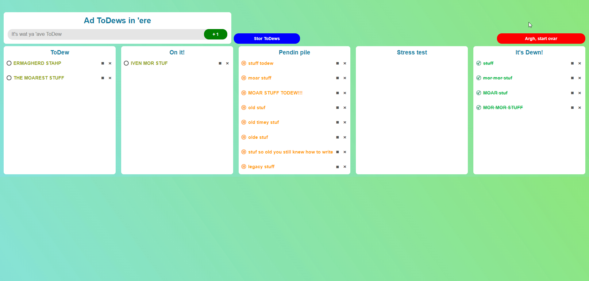

# ToDew - ToDo for DumDums

**ToDew is ToDo for DumDums:**
1. shainy colors
2. drag'n'drop ToDews
3. meny ToDew states
4. fil gud 4 gud werk

## Ok fr fr now:
I used this as a base to better unsderstand event-handling and as an opportunity to remind myself to appretiate jQuery just... for existing.

### Install:
- No install needed, just clone the repo and run index.html

### Usage:
- the blue button saves an image of the boards
- the red button clears the working copy of the boards
- refreshing the page loads the saved boards and overwrites the working copy
- that's about it

#### Disclaimer:
For public health purposes the creator strongly advises against checking out the css file as it is a cesspool and you might catch something nasty, but then again what css file isn't **AMIRITE!?** _Heh..._ _...heh..._ \*weep\*
